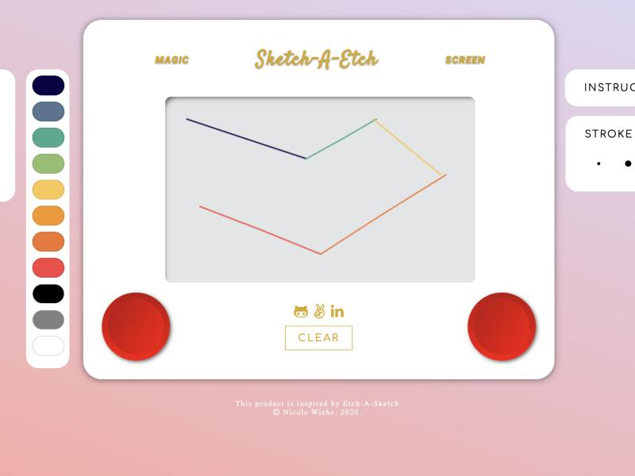

# Sketch-A-Etch

A vanilla JavaScript recreation of the classic Etch-A-Sketch toy, built on the HTML5 Canvas API — no frameworks, no drawing libraries, just the DOM and 2D canvas context.

**[Live demo →](https://nykiway.github.io/Sketch-A-Etch/)**



## Features

- **Draw three ways** — arrow keys (the authentic two-dial feel), mouse, or touch/finger on mobile.
- **11-color palette** and **3 stroke widths**, switchable mid-drawing.
- **Shake to clear** — click "CLEAR" and the whole frame shakes, just like the real toy.
- Fully responsive canvas: drawing coordinates stay accurate even as the canvas scales down on smaller screens.
- **Keyboard accessible** — every control (dials, color swatches, stroke widths) is a real, focusable, `Enter`/`Space`-activatable control, and a live region announces color/stroke changes for screen readers.
- A little easter egg in the left dial, for anyone hiring.

## Tech stack

- Vanilla JavaScript (ES modules) — no frameworks or canvas libraries
- HTML5 Canvas 2D API
- Webpack 5 + Babel for bundling/transpiling
- Jest for unit tests, ESLint for linting
- Plain CSS (no preprocessor)
- CI (lint + test + build) on every push/PR, deployed via GitHub Actions → GitHub Pages

## Project structure

```
src/
  main.js            entry point — wires up all modules
  canvas.js           drawing engine: keyboard, mouse & touch input
  geometry.js          pure, unit-tested math (coordinate mapping, pen state)
  palette.js           color/stroke data + label formatting, unit-tested
  a11y.js              shared keyboard-activation helper for custom controls
  colorPicker.js       color palette logic
  strokeSelector.js    stroke width logic
  modal.js             "About this project" dial modal
  instructions.js      instructions dropdown
  __tests__/           Jest unit tests
stylesheets/           one stylesheet per component
```

## Running locally

```bash
npm install
npm start        # webpack --watch, rebuilds dist/bundle.js on save
```

Then open `index.html` directly in a browser (or serve the folder with any static server).

```bash
npm test          # run the unit tests
npm run lint      # lint src/
npm run build     # production build
```

---

This product is inspired by Etch-A-Sketch. © Nicole Wiehe, 2020.
